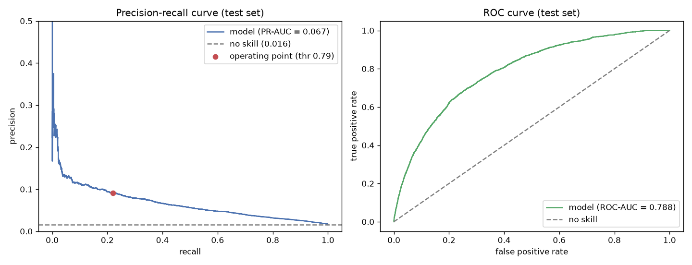
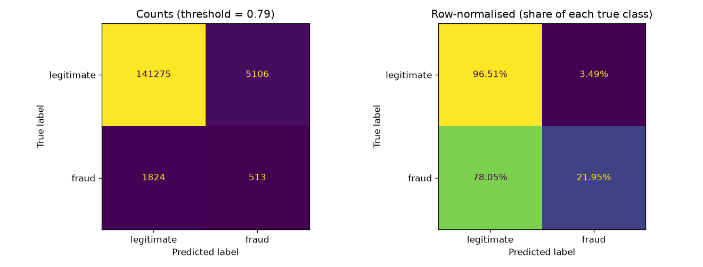
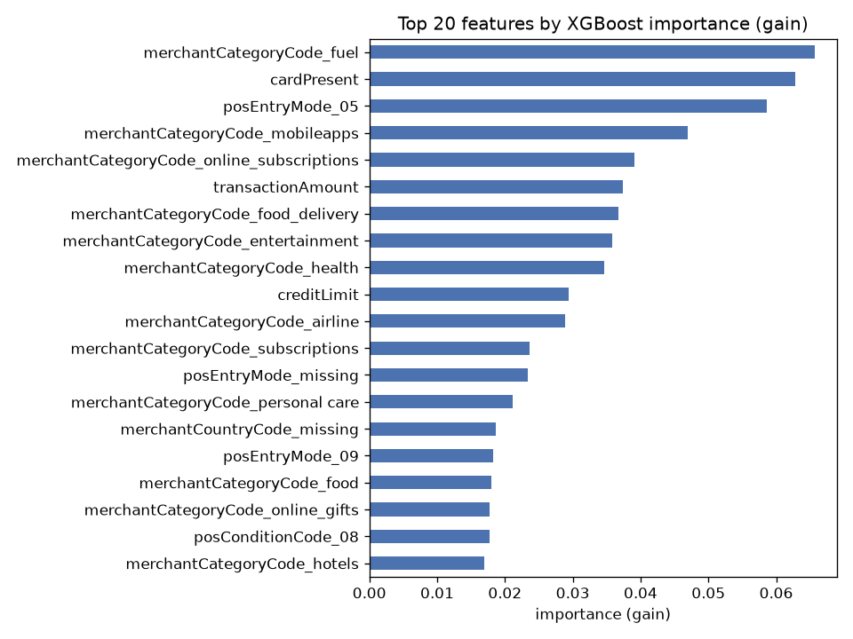

# Credit Card Fraud Prediction

An end-to-end machine learning project on a year of credit card transactions:
exploratory analysis, data cleaning, a baseline fraud classifier, and a small
Streamlit app that scores a single transaction. It is built MVP-first. The aim is
a correct, reproducible pipeline from raw download to a working demo, not a tuned
model or a competition score.

## Data

The [Capital One Data Science recruiting dataset](https://github.com/CapitalOneRecruiting/DS)
of synthetic credit card transactions. `notebooks/01_eda.ipynb` downloads and
unpacks it, so the data is never committed. It is 786,363 transactions from 5,000
accounts over the 2016 calendar year, with a 1.6% fraud rate. The data is
synthetic and built for a take-home exercise, so it contains no real customer
information.

## Pipeline

| Notebook | Step | Output |
| --- | --- | --- |
| `notebooks/01_eda.ipynb` | Download, load (newline-delimited JSON), and describe the data | `data/raw/transactions.parquet` cache |
| `notebooks/02_data_wrangling.ipynb` | Detect reversed and multi-swipe duplicate transactions, measure their dollar impact, drop them | `data/processed/transactions_deduped.parquet` |
| `notebooks/03_modeling.ipynb` | Feature engineering, stratified split, baseline XGBoost, threshold-aware evaluation | `models/fraud_model_v1.pkl` |
| `notebooks/04_reporting.ipynb` | Performance figures, business summary, methods and future work | `reports/figures/*.png` |
| `app.py` | Streamlit demo: score a sample or hand-entered transaction | - |

Feature construction is shared between the modeling notebook and the app in
`features.py`, so training and serving stay in step.

## Data cleaning

Two duplicate patterns are removed before modeling (about 5% of rows):

- **Reversed transactions:** a purchase later undone by a matching reversal on the
  same account, merchant, and amount. About 17,800 pairs, roughly $2.7M that nets
  to zero. Both legs are dropped.
- **Multi-swipe transactions:** the same card, merchant, and amount charged two or
  more times within 5 minutes, a point-of-sale retry. About 7,300 follow-on
  swipes, roughly $1.1M. The first charge in each burst is kept.

## Results

Baseline **XGBoost** at default settings, with `scale_pos_weight` for the class
imbalance. Evaluated on a held-out 20% test set. Accuracy is not reported because
it is meaningless at a 1.6% base rate.

| Metric | Value |
| --- | --- |
| ROC-AUC | 0.79 |
| PR-AUC (average precision) | 0.067, about 4x the 0.016 no-skill baseline |
| At the chosen threshold (0.79) | precision 0.09, recall 0.22, F1 0.13 |

The model finds real signal: it ranks a random fraud above a random legitimate
transaction about 79% of the time. As a hard yes/no flag it is weak, catching
about one in five frauds with many false alarms. That is expected for a first
pass with no tuning and no merchant-level or per-account behavioural features.
The threshold is a dial between catching more fraud and raising fewer false
alarms; where to set it is a business decision.







The strongest signals are the merchant category, whether the card was physically
present, how the card was entered, the credit limit, and the transaction amount.
This lines up with the EDA finding that fraud skews toward card-not-present
transactions.

## Reproduce

```
py -3 -m venv .venv
.venv\Scripts\activate
pip install -r requirements.txt
```

Run the notebooks in order (`01` downloads about 30 MB and writes a ~600 MB
extracted file to `data/raw/`):

```
jupyter nbconvert --to notebook --execute --inplace notebooks/01_eda.ipynb
jupyter nbconvert --to notebook --execute --inplace notebooks/02_data_wrangling.ipynb
jupyter nbconvert --to notebook --execute --inplace notebooks/03_modeling.ipynb
jupyter nbconvert --to notebook --execute --inplace notebooks/04_reporting.ipynb
```

Then run the demo:

```
streamlit run app.py
```

## Methods considered and future work

Covered in full in `notebooks/04_reporting.ipynb`. In short:

- **Algorithm:** XGBoost for the baseline. A Random Forest scored slightly lower
  and produced a ~340 MB model file versus ~0.4 MB, which matters for the app.
- **Imbalance:** `scale_pos_weight`. SMOTE is the untested alternative.
- **Threshold:** picked by maximising F1 on a validation split. A cost-based
  threshold would be better.
- **Next:** per-account behavioural features, bring back `merchantName` with
  target encoding, compare imbalance strategies, k-fold tuning, probability
  calibration, and deploy the app to Streamlit Community Cloud.

## Layout

```
data/            raw/ (gitignored download) and processed/ (gitignored dedup output)
notebooks/       01 EDA, 02 wrangling, 03 modeling, 04 reporting
features.py      shared feature engineering
models/          fraud_model_v1.pkl (pipeline + threshold + metrics)
reports/figures/ exported performance charts
app.py           Streamlit demo
```
